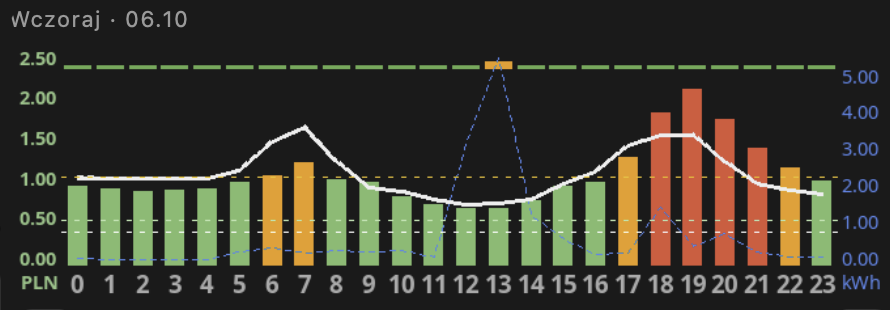

# TGE RDN — ceny energii z giełdy (Rynek Dnia Następnego)

> **Fully coded by Claude AI** — not a single line of code was written manually by a human.

Pobiera z **tge.pl** notowania **Rynku Dnia Następnego** — **Fixing I**, **notowania ciągłe**, **Fixing II** i podsumowanie dnia — dla produktów **godzinowych** i **15-minutowych**, i zapisuje je do MySQL / MariaDB (albo wypisuje jako CSV). Bez API, bez kluczy, bez bibliotek — jeden plik PHP + dwa skrypty.

Ceny na jutro są znane już **ok. 11:00** dzisiaj. Mając je u siebie, możesz np.:

- zaplanować na jutro pracę bojlera, grzałek, ładowarki auta czy pompy ciepła w **najtańszych godzinach** — zanim swoje ceny opublikuje sprzedawca z taryfą dynamiczną,
- **oszacować** cenę taryfy dynamicznej (np. Pstryk) z wyprzedzeniem: cena TGE + dystrybucja + marża + akcyza, razy VAT,
- analizować ceny godzinowe i 15-minutowe, wolumeny, różnice między fixingami.

*English: Polish Power Exchange (TGE) day-ahead market prices — Fixing I, continuous trading, Fixing II — hourly and 15-minute products, into MySQL/MariaDB or CSV.*

<h3>Co potrafi:<br>ceny na jutro · Fixing I i II · notowania ciągłe · produkty 60 i 15 min · wolumeny · CSV albo baza</h3>

### Przykład zastosowania — TymOS

W [TymOS](https://github.com/tymoteuszrogalewski/tymos) ceny Fixing I służą jako **prognoza cen Pstryka na jutro**, zanim Pstryk je opublikuje — na wykresie to biała przerywana linia; po publikacji zastępuje ją biała ciągła:

<br>
*Słupki — ceny Pstryka w ciągu doby (zielone tanie, czerwone drogie). Biała ciągła linia to ceny Pstryka na jutro, biała przerywana — prognoza na podstawie TGE. Niebieska przerywana linia to zużycie domu.*

## Pliki

```
go.sh               pobiera notowania na dziś i jutro — do crona
history.sh          pobiera notowania dzień po dniu
tge.inc.php         biblioteka: pobranie, parsowanie, zapis
tge_day.php         to, co uruchamia go.sh
tge_history.php     to, co uruchamia history.sh
config.example.php  wzór konfiguracji
schema.sql          tabela tge_rdn
```

## Wymagania

- PHP 7.4+ z rozszerzeniami `curl` i `mysqli` (na Debianie / Raspberry Pi OS: `apt install php-cli php-curl php-mysql`)
- MySQL / MariaDB — opcjonalnie (bez bazy dane lecą jako CSV)

## Instalacja

```bash
git clone https://github.com/tymoteuszrogalewski/tge-rdn.git
cd tge-rdn
cp config.example.php config.php
nano config.php                     # dane bazy, produkty 60 i/lub 15 min
mysql tge < schema.sql              # tylko przy zapisie do bazy
```

## Użycie

Daty to zawsze dni **dostawy** energii (sesja na giełdzie odbywa się dzień wcześniej).

```bash
./go.sh                             # dziś + jutro
./go.sh 2026-10-08                  # jeden wybrany dzień
./history.sh 2026-08-15             # od 15 sierpnia do jutra
./history.sh 2026-08-15 2026-08-31  # wybrany zakres
```

Strona TGE pokazuje notowania tylko z **ok. 2 ostatnich miesięcy** — dla starszych dni skrypt zwraca 0 wierszy. Dlatego warto uruchomić go w cronie od razu i zbierać dane na bieżąco. Starszą historię cen godzinowych TGE (Fixing I) można pobrać przez [pstryk-api](https://github.com/tymoteuszrogalewski/pstryk-api) (kolumna `price_tge`).

**Cron** — co godzinę w ciągu dnia (Fixing I ok. 11:00, Fixing II i notowania ciągłe później):

```
20 8-16 * * *  /sciezka/tge-rdn/go.sh >/dev/null
```

**Tryb CSV** — ustaw `DB_NAME` na `''`. Kolumny jak w tabeli poniżej, rozdzielone `;`.

## Tabela

| kolumna | znaczenie |
|---|---|
| `ts_utc` + `period` | początek okresu (UTC) i długość: `60` godzina, `15` kwadrans (klucz) |
| `ts_local` | początek okresu, czas polski |
| `fix1_price` / `fix1_volume` | Fixing I: kurs PLN/MWh, wolumen MW |
| `cont_price` / `cont_volume` | notowania ciągłe: kurs średnioważony PLN/MWh, wolumen MW |
| `fix2_price_eur`, `fix2_price` | Fixing II: kurs jednolity EUR/MWh i PLN/MWh |
| `fix2_volume`, `fix2_volume_buy`, `fix2_volume_sell` | Fixing II: wolumeny MW |
| `total_min`, `total_max`, `total_avg` | łącznie: kurs min., max., średnioważony PLN/MWh |
| `total_volume`, `total_volume_buy`, `total_volume_sell` | łącznie: wolumeny MWh |

Ceny są w **PLN/MWh**, jak na tge.pl — na zł/kWh dzielisz przez 1000. Brak notowania (np. brak transakcji w notowaniach ciągłych) zapisuje się jako `NULL`. Kolejne wiersze liczone są od północy czasu polskiego, więc dni zmiany czasu (23 i 25 godzin) zapisują się poprawnie.

```sql
-- ceny godzinowe na jutro w zł/kWh
SELECT ts_local, fix1_price / 1000 AS zl_kwh FROM tge_rdn
WHERE period = 60 AND DATE(ts_local) = CURDATE() + INTERVAL 1 DAY ORDER BY ts_local;

-- 3 najtańsze godziny jutro
SELECT ts_local, fix1_price FROM tge_rdn
WHERE period = 60 AND DATE(ts_local) = CURDATE() + INTERVAL 1 DAY ORDER BY fix1_price LIMIT 3;
```

## Uwagi

- TGE nie udostępnia publicznego API — skrypt czyta stronę notowań. Jeśli TGE zmieni jej wygląd, skrypt może wymagać poprawki.
- Nie odpytuj strony częściej niż kilka razy na godzinę. Między zapytaniami jest przerwa (`TGE_PAUSE`).
- Dane należą do Towarowej Giełdy Energii S.A.; ten projekt nie jest z nią powiązany.

## Pochodzenie

Moduł wydzielony z [TymOS](https://github.com/tymoteuszrogalewski/tymos) — lekkiego systemu automatyki domowej na Raspberry Pi.

## Licencja

MIT — patrz [LICENSE](LICENSE).
